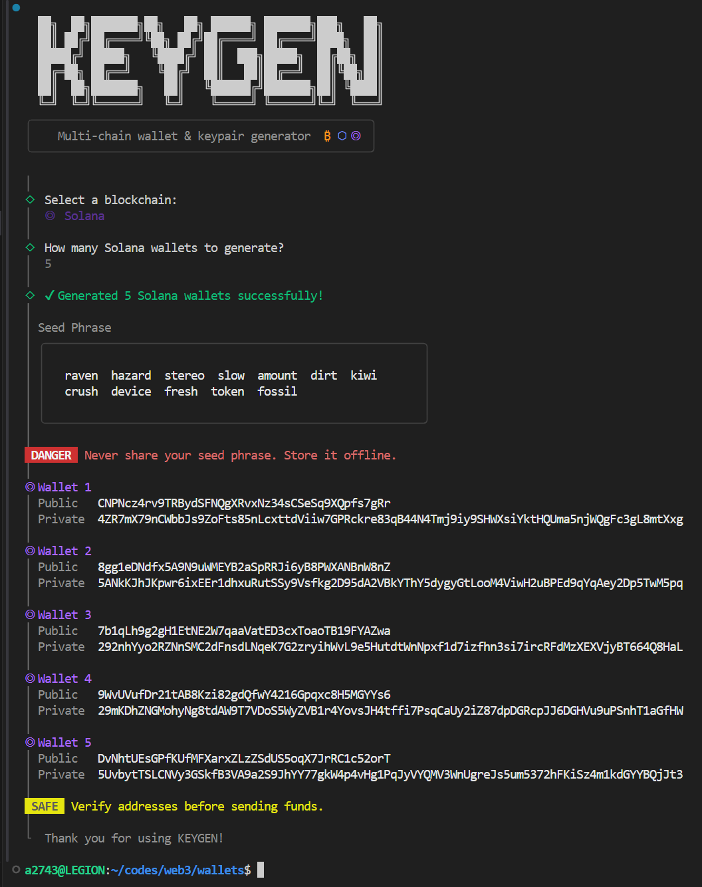

# Keygen CLI

A minimal **multi-chain wallet and keypair generator** built for the terminal.

This CLI generates deterministic wallets using a BIP-39 mnemonic and supports multiple blockchains. 

Currently supported chains:

* ◎ Solana
* ⬡ Ethereum
* ₿ Bitcoin

---

## Installation

Clone the repository and install dependencies:

```bash
git clone https://github.com/ajaxonchain/blockchain-keygen.git
cd blockchain-keygen
npm install
```

---

## Running the CLI

You can run the CLI locally using:

```bash
npm start
```

or directly with Node:

```bash
node bin/keygen.js
```

---

## Running as a Global Command (Optional)

To use the CLI globally:

```bash
npm link
```

Now you can run the command from anywhere:

```bash
keygen
```

---

## Uninstall Global Link

If you want to remove the global command later:

```bash
npm unlink -g
```


---

# Example Output



---

# Key Generation Overview

### Seed Creation

The seed phrase is generated using the BIP-39 standard:

```js
const mnemonic = generateMnemonic()
const seed = mnemonicToSeedSync(mnemonic)
```

The seed becomes the root entropy for all wallets.

---

### Solana Keys

Solana uses **Ed25519** keys.

Steps:

1. Derive a path from the seed

```
m/44'/501'/index'/0'
```

2. Generate the keypair using `tweetnacl`
3. Encode keys using Base58

```js
const derivedSeed = derivePath(path, seedHex).key
const secret = nacl.sign.keyPair.fromSeed(derivedSeed)
```

---

### Ethereum Keys

Ethereum uses **secp256k1** elliptic curve cryptography.

Wallets are derived using:

```
m/44'/60'/0'/0/index
```

Using `ethers` HD wallet utilities:

```js
HDNodeWallet.fromPhrase(mnemonic, undefined, path)
```

---

### Bitcoin Keys

Bitcoin also uses **secp256k1**, but with a different path:

```
m/44'/0'/0'/0/index
```

Steps:

1. Create BIP-32 root node
2. Derive child keys
3. Generate P2PKH address

```js
const child = root.derivePath(path)
bitcoin.payments.p2pkh({ pubkey: child.publicKey })
```

